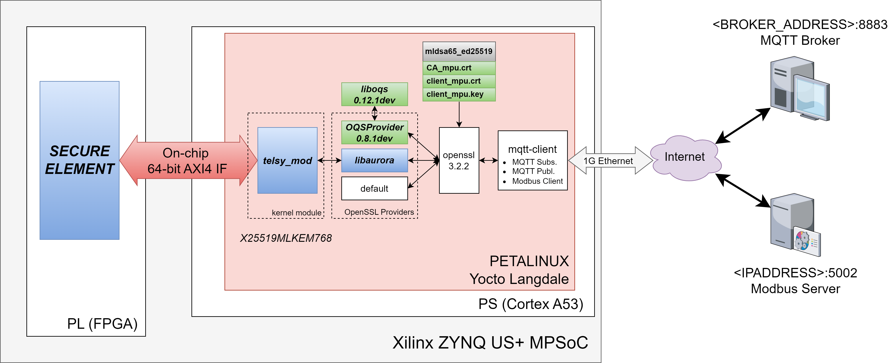

# dm_iot_mpu
The repository contains a link to the Zenodo repository of the *Board Support Package* (BSP) for the AMD Xilinx ZCU104 of the Petalinux project to implement the MQTT client node of the Digital Manufacturing Internet-of-Things Pilot demonstrator (a.k.a. Pilot 2) MPU version for the QUBIP project (https://qubip.eu/). Refer to the following lines for the upstream versioning of the project:

* *Current Version:* v1.0
* *Name of the BSP:* qubip_dm_iot_mpu_1v0.bsp
* *SHA256 of the BSP:* d75fdbae8b602557ed903cad41f39c69957834eef248ad5462586d037687b64c
* *DOI*: 10.5281/zenodo.15304129
* *Link*: https://zenodo.org/records/15304129

# What is inside the package?
The BSP package contains all the necessary files and scripts to recreate the Petalinux and Vivado projects for the PQC-protected MQTT client device on an AMD Xilinx ZCU104 development board (https://www.amd.com/en/products/adaptive-socs-and-fpgas/evaluation-boards/zcu104.html). The whole project has been created using the following tools and operating system:

| Purpose | Tool | Version |
| --- | --- | --- |
| Software and Firmware | Petalinux | 2024.1 |
| Hardware | Vivado | 2024.1 |
| Host OS | Ubuntu | 22.04LTS |

The main device implementing the MQTT client is the AMD Xilinx Zynq UltraScale+ XCZU7EV-2FFVC1156 MPSoC. Both, the Programming System (PS, hard-macro processors) and the Programmable Logic (PL, FPGA resources) are used in this project.

# How to build and run?
The re-generate the project starting from the BSP, it is recommended to, at least, use the same version of Petalinux and Vivado tools mentioned above to avoid compatiblity issue. Once downloaded the BSP file, open a terminal and enter what follows:

```bash
petalinux-create project -s <bsp-package>
```
This command will create a folder named "xilinx-zcu104-2024.1" with the whole project. Therefore, to build the project:

```bash
cd <path-to>/xilinx-zcu104-2024.1
petalinux-build
```

At the end of the build, the Petalinux project folder will have the following sub-folders:

```bash
xilinx-zcu104-2024.1
  |
  |--- build              # build folder
  |--- components         # Petalinux and Yocto main configurations and recipes
  |--- conf               # Petalinux auto-generate configurations
  |--- hardware           # Hardware project with Vivado files for the FPGA part (PL) of the project
  |--- images             # Output artifacts of the build system
  |--- pre-built          # Pre-built artifacts (DO NOT USE THEM!)
  |--- project-spec       # Custom recipes, applications and kernel modules

```

After the build, the output artifacts in the _images_ folder needs to be packed to be written in a properly formatted micro-SD card (see https://docs.amd.com/r/2024.1-English/ug1144-petalinux-tools-reference-guide/Preparing-the-SD-Card). This operation can be performed by navigating to the main folder of the project (namely, _xilinx-zcu104-2024.1_) and entering:

```bash
petalinux-package boot --force --fpga images/linux/system.bit --atf --psmfw --u-boot --dtb
```
This will generate the following files:
* BOOT.BIN
* image.ub
* boot.scr
* rootfs.cpio (it is an actual archive)

Once these artifacts are properly transferred on the micro-SD, it is sufficient to power-up the ZCU104 with micro-SD card inserted in the the dedicated slot. In this version, the MQTT-client is not self-launching, therefore you need to login on the ZCU104. As the 

The Petalinux build has only two users:
* root (no password needed, *USE AT YOUR OWN RISK!*)
* petalinux (default password _petalinux_, *AS ABOVE!*)

Users, passwords and configurations can be easily changed by using the "petalinux-config" command, before build. 

To open a simple shell on the system, it is enough to connect the board to a host computer with a USB cable connect to J164 (near the micro-SD slot), and use a terminal like _minicom_ or _PuTTY_, configured to a baudrate of 115200bps. On Linux systems, the board is enumerated with 4 USB endpoints. Assuming that its enumeration starts at ttyUSB0, the proper endpoint to use for this connection is ttyUSB1:

```bash
minicom -D /dev/ttyUSB1 115200
```

# Main features
The project contains many useful tools and applications for MQTT and PQC/PQC-hybrid TLS connection, backed up by the hardware acceleration offered by the SE implemented on the PL part of the Zynq. A block diagram of the implemented system is shown below:



The *mqtt-client* (see https://github.com/QUBIP/mqtt-client-openssl) is an application that allows the system to act as a MQTT publisher/subscriber towards a remote MQTT broker with mutually authenticated TLS, where the reading value comes from a ModBus remote server. The *mqtt-client* application leverages on OpenSSL 3.2.2 to perform the mutually authenticated TLS connection. The PQC and PQC-T functionality are enabled by two OpenSSL3 compatible providers:
* _OQSProvider_ 0.8.1dev (see https://github.com/open-quantum-safe/oqs-provider), backed by the _liboqs_ 0.12.1dev (see https://github.com/open-quantum-safe/liboqs)
* *libaurora*, which is a porting of the QUBIP's PQC Provider for OpenSSL (see https://github.com/QUBIP/aurora) that leverages the hardware Secure Element (SE) connected to the PS through the AXI interface

The hardware Secure Element functionalities are available for the operative system by means of a dedicated kernel module namely *telsy_mod*, also available in the BSP.

The *mqtt-client* is launched with the following command:

```bash
mqtt-client --ca-cert <CA_certificate> \
            --client-cert <client_certificate> \
            --client-key <client_key> \
            --modbus-ip <modbus_server_ip> \
            --modbus-port <modbus_server_port> \
            --modbus-register <modbus_server_register> \
            --mqtt-broker  <mqtt_broker_ip> \
            --mqtt-port <mqtt_borker_port> \
            --mqtt-device-name <device_name> \
            --mqtt-topic <mqtt_topic>
```

When launched, the *mqtt-client* spawns three threads:
1. Open a TCP/IP session with the ModBus Server
2. Start a PQC-protected TLS connection towards the MQTT Broker for publishing on the specified topic
3. Make a request to the MQTT Broker for subscription on the same topic

Note that all the certificates in this implementation are *mldsa65_ed25519*, while the *Key Encapsulation Mechanism* (KEM) is forced to be *X25519MLKEM768*.

# Disclaimer
The provided

# License
See License.

# Authors
Davide Bellizia (davide.bellizia@telsy.it)
Agostino Sette (agostino.sette@telsy.it)


